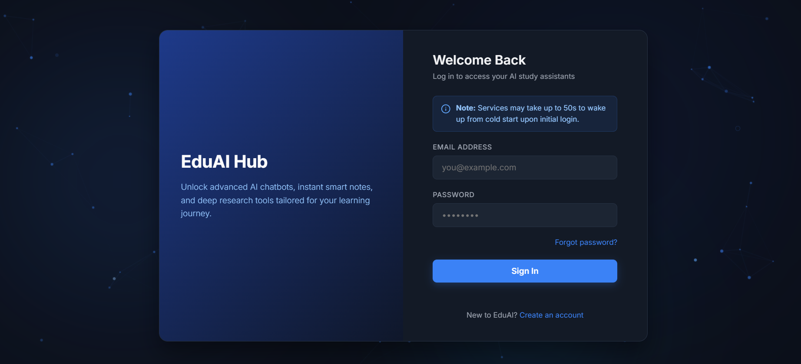
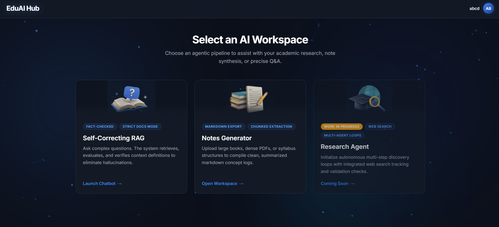
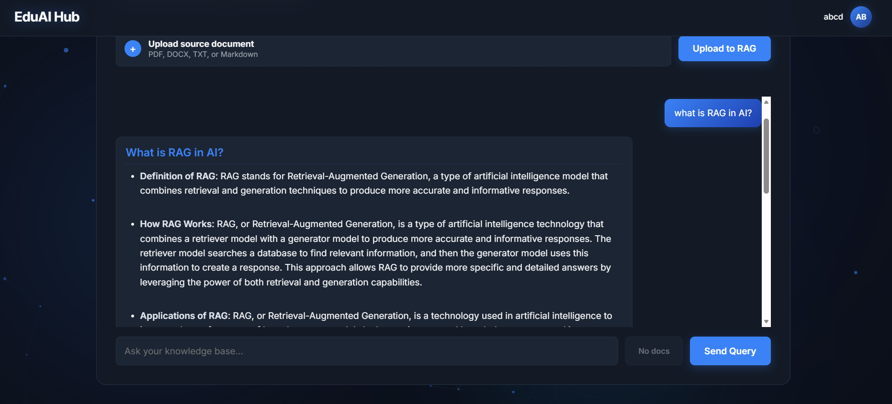
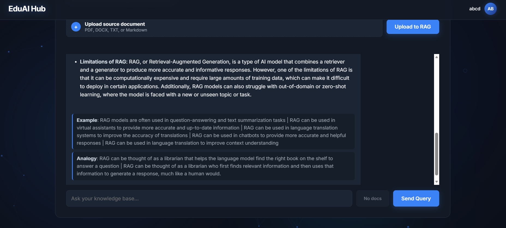
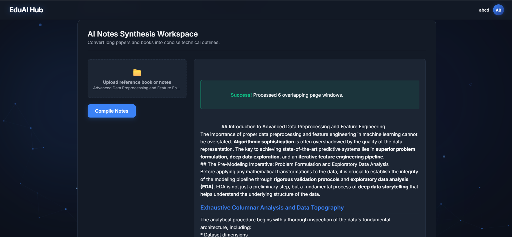

# EduAI Hub 🎓

EduAI Hub is an advanced Ed-Tech platform that empowers students and researchers with cutting-edge AI tools to enhance learning, synthesis, and deep research. 

Built with FastAPI on the backend and a modern vanilla JS/CSS frontend, the platform provides seamless integration with various LLM and retrieval agents.

---

## Features & Modules

### 1. Authentication & Login
Secure login system with cookie-based authentication, ensuring user data privacy and session persistence.


### 2. Workspace Dashboard
The central hub for all AI tools. Select between InsightAI, Forger, or ExplorerAI.


### 3. InsightAI (Verified RAG)
Upload your own documents (PDF, DOCX, TXT, or Markdown) and ask complex questions. The system retrieves, evaluates, and verifies context definitions to eliminate hallucinations. Includes a toggle for "Strict Docs Mode" or flexible general knowledge.

> **Intelligent Formatting:** As seen in the screenshot below, the chatbot automatically structures answers into logical sections, explicitly providing intuitive **analogies** and practical **examples** to maximize understanding.

<p align="center">
  
  
</p>

### 4. Forger (AI Synthesis)
Convert long papers, books, or syllabuses into clean, summarized markdown concept logs. Forger extracts chunked knowledge and provides structured outputs.

> **Unlimited Context Resolution:** Capable of precisely parsing huge documents with a level of accuracy where normal models would run out of context length, ensuring high-fidelity extraction without lost details!

<p align="center">
  
  
</p>

### 5. ExplorerAI (Autonomous Research) **(Coming Soon)**
Initialize autonomous multi-step discovery loops with integrated web search tracking and validation checks. Track live agentic reasoning execution paths directly on your dashboard.


---

## Technology Stack
- **Backend:** FastAPI, Python, SQLAlchemy, PostgreSQL
- **Frontend:** HTML5, CSS3, Vanilla JavaScript
- **AI Integration:** LangChain, Pinecone (Vector Store), Docling Document Converter
- **Authentication:** OAuth2 with JWT

---

## Local Development Setup

1. **Clone the repository:**
   ```bash
   git clone https://github.com/your-username/ai-ed-tech-platform.git
   cd ai-ed-tech-platform
   ```

2. **Set up the virtual environment:**
   ```bash
   python -m venv .venv
   source .venv/bin/activate  # On Windows: .venv\Scripts\activate
   ```

3. **Install dependencies:**
   ```bash
   pip install -r requirements.txt
   ```

4. **Environment Variables:**
   Create a `.env` file in the root directory and provide the necessary API keys and database credentials (e.g., PostgreSQL credentials, Pinecone keys, LLM API keys).

5. **Run the backend server:**
   ```bash
   uvicorn main:app --reload
   ```

6. **Access the platform:**
   Open your browser and navigate to `http://localhost:8000` to access the frontend and API simultaneously.
